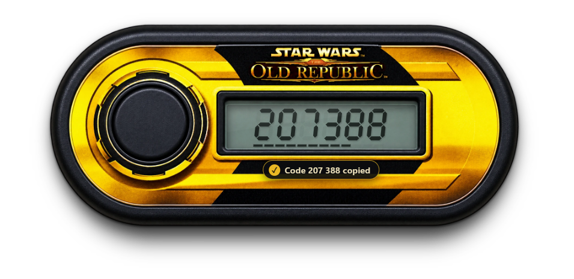

<p align="center"></p>

<h1 align="center">SWTOR Security Key</h1>

<p align="center">
  A desktop replica of the classic SWTOR security key fob that generates your Star Wars: The Old Republic security codes locally on your PC.<br>
  <a href="https://github.com/DDZ76-Dev/SWTOR-Fob-App/actions/workflows/ci.yml"></a>
  <a href="https://scorecard.dev/viewer/?uri=github.com/DDZ76-Dev/SWTOR-Fob-App"></a>
  <a href="LICENSE"></a>
</p>

> [!IMPORTANT]
> **Unofficial fan-made tool.** Not affiliated with, endorsed by or sponsored by Electronic Arts, Broadsword Online Games or Lucasfilm. It's free, it will never ask for your SWTOR or EA password, and it never connects to the game or EA's servers.



## Features

- **Realistic key fob.** A seven-segment LCD with faint unlit segments, a press-down button and a drop shadow on your desktop.
- **Standard SWTOR codes.** 6-digit time-based codes (TOTP, RFC 6238), the same codes Google Authenticator makes for SWTOR.
- **Click the digits to copy.** A notification confirms what was copied. If the code changes while the display is on, the clipboard is updated, and it's cleared when the display turns off.
- **Internet time sync.** Press the button to check the time with public time servers, so a wrong Windows clock can't cause rejected codes.
- **Follows the SWTOR launcher.** The app waits in the system tray. When the launcher opens, the fob appears beside it with the display on, without taking focus from the login box. When the game starts, the fob hides to the tray.
- **Locked, encrypted key.** You set it up once from the swtor.com QR code. After that it can only be removed, never edited or read back.
- **Remembers its position** on your screen.

## Install

1. Download the latest **`SWTOR Security Key-Setup-x.y.z.exe`** from [Releases](https://github.com/DDZ76-Dev/SWTOR-Fob-App/releases).
2. Optional: check the download is genuine (see [Verifying a download](SECURITY.md#verifying-a-download)).
3. Run the installer. Until the app is code-signed, Windows SmartScreen may warn about an unrecognised app. Choose **More info → Run anyway**.
4. Follow the setup wizard. It installs for your Windows account only (no administrator rights needed), lets you choose the folder, and adds Start Menu and Desktop shortcuts.

The app then starts hidden in the system tray each time you sign in to Windows, ready for the SWTOR launcher. To stop that, untick **Open with SWTOR launcher** in the tray icon menu.

To uninstall, use Windows **Settings → Apps → Installed apps → SWTOR Security Key**. This removes the app, its shortcuts and its startup entry. Your attached key stays in `%APPDATA%\swtor-security-key` in case you reinstall. Delete that folder to remove the key too.

## Attach your security key

1. On [swtor.com](https://www.swtor.com), open your account's **Security** section and choose **Add Security Key**. SWTOR emails you a one-time password to enter.
2. When the QR code appears, scan it with your phone's authenticator app as well if you want codes on your phone too.
3. In this app, press the button or click ⚙. Load a screenshot of the QR code, paste it (Ctrl+V), drag it onto the panel, or type the setup key.
4. Check that the code in the app matches your phone, then finish setup on swtor.com.
5. **Delete the QR screenshot.** Anyone who has it can generate your codes.

The old SWTOR Security Key mobile app and the physical fob are no longer supported by EA, and their keys can't be imported.

To try the app first, load [`test-qr.png`](test-qr.png). It holds a dummy key that isn't linked to any account. Remove it with ⚙ → **Remove key** before attaching your real one.

## Use

| Action | What it does |
| --- | --- |
| Click the digits | Copies the current code |
| Press the round button (or Space) | Refreshes the display and syncs with internet time |
| Hover over the fob | Shows ⚙ key info, minimize and close |
| Drag the fob | Moves the window (the position is remembered) |
| Close (✕) | Hides the app to the system tray |
| Tray icon right-click | Show the key, turn **Open with SWTOR launcher** on or off, or **Quit** |

## Privacy and security

There's no tracking or analytics, no accounts and no update check. The only network traffic is time checks against public time servers. Your key is encrypted with Windows DPAPI and never leaves your PC. [SECURITY.md](SECURITY.md) has the full details and explains how to report a vulnerability.

## Build from source

Requires Node.js 22 or later on Windows.

```
npm ci
npm start        # run the app
npm test         # code, launcher-detection and desktop app tests
npm run dist     # build the installer .exe into dist/
```

Releases are built by GitHub Actions when a `v*` tag is pushed. Each release gets build provenance attestations and SHA-256 checksums, and is code-signed when signing secrets are configured (see [`.github/workflows/release.yml`](.github/workflows/release.yml)).

## License

The source code is under the [MIT license](LICENSE). Star Wars, The Old Republic and SWTOR names, logos and artwork belong to their respective owners and aren't covered by that license.
